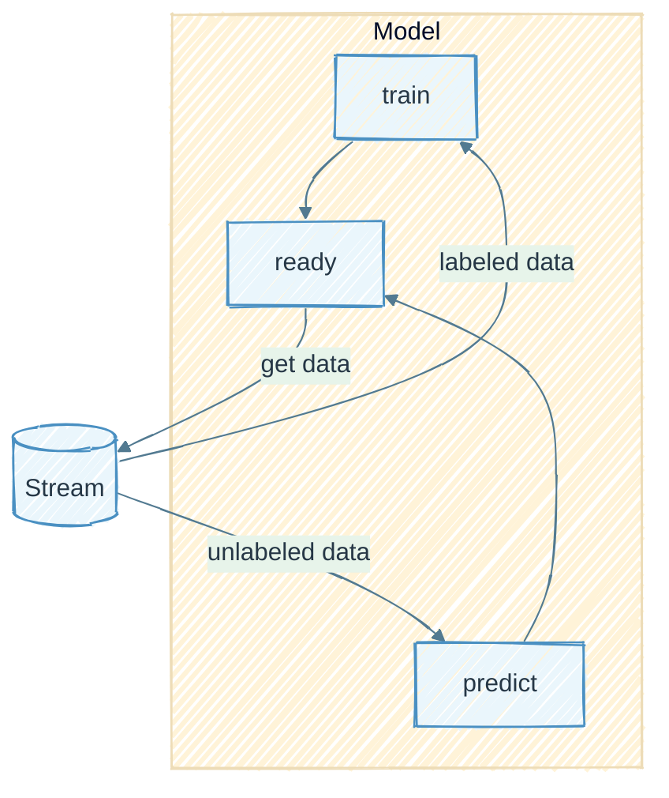

# Getting started

This guide shows the fastest path from install to a working online deep learning model.

deep-river follows the [river](https://www.riverml.xyz) streaming API while letting you use
PyTorch modules for representation learning.

The core workflow is a stream loop: make a prediction for the next item, update a metric,
and then call `learn_one` so the model adapts before the next item arrives.



## Install

```bash
pip install deep-river
```

or:

```bash
pip install "river[deep]"
```

To use the latest development branch:

```bash
pip install https://github.com/online-ml/deep-river/archive/refs/heads/main.zip
```

## Build your first online classifier

The example below defines a small PyTorch module, wraps it in a deep-river `Classifier`,
and evaluates it online on river's phishing dataset.

```python
import random

import numpy as np
from river import compose, datasets, metrics, preprocessing
from torch import manual_seed, nn

from deep_river.classification import Classifier

_ = manual_seed(42)
random.seed(42)
np.random.seed(42)

first_x, _ = next(iter(datasets.Phishing()))
n_features = len(first_x)


class MLP(nn.Module):
    def __init__(self, n_features: int):
        super().__init__()
        self.net = nn.Sequential(
            nn.Linear(n_features, 16),
            nn.ReLU(),
            nn.Linear(16, 2),
        )

    def forward(self, x):
        return self.net(x)


model = compose.Pipeline(
    preprocessing.StandardScaler(),
    Classifier(
        module=MLP(n_features),
        loss_fn="cross_entropy",
        optimizer_fn="adam",
        lr=1e-3,
        is_class_incremental=True,
    ),
)

metric = metrics.Accuracy()

for i, (x, y) in enumerate(datasets.Phishing().take(200)):
    if i > 0:
        y_pred = model.predict_one(x)
        metric.update(y, y_pred)
    model.learn_one(x, y)

print(f"Accuracy: {metric.get():.4f}")
```

```python
from torch import nn

from deep_river.regression import RollingRegressor


class GrowingSequence(nn.Module):
    def __init__(self):
        super().__init__()
        self.gru = nn.GRU(input_size=2, hidden_size=4)
        self.head = nn.Linear(4, 1)

    def forward(self, x):
        output, _ = self.gru(x)
        return self.head(output[-1])


model = RollingRegressor(
    module=GrowingSequence(),
    is_feature_incremental=True,
    window_size=3,
)
model.learn_one({"b": 2.0, "d": 4.0}, 1.0)
model.learn_one({"a": 1.0, "c": 3.0, "e": 5.0}, 2.0)

assert list(model.observed_features) == ["a", "b", "c", "d", "e"]
assert list(model._x_window) == [
    [0.0, 2.0, 0.0, 4.0, 0.0],
    [1.0, 0.0, 3.0, 0.0, 5.0],
]
prediction = model.predict_one({"f": 6.0})
assert all(len(row) == 6 for row in model._x_window)
```

## Core concepts

- **`learn_one` updates the model online:** each sample is used exactly once in sequence.
- **Pipelines are composable:** combine river transformers and deep-river estimators.
- **PyTorch modules stay flexible:** define any architecture you need and pass it to deep-river.
- **Metrics update continuously:** evaluate stream performance during training.

## Where to go next

- Use [Examples](examples/index.md) for end-to-end notebooks across tasks.
- Inspect [Benchmarks](benchmarks/index.md) to compare model families.
- Use [API Reference](reference/index.md) for parameter-level documentation.

If something is unclear or broken, please [open an issue](https://github.com/online-ml/deep-river/issues/new).
