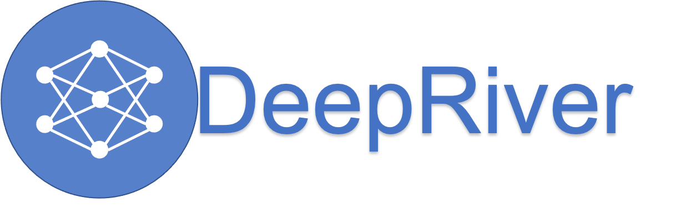

# Online deep learning with PyTorch and river

<section class="landing-hero">
  

    
    
deep-river

    

      Train PyTorch models incrementally on data streams with river's familiar
      <code>predict_one</code>, <code>learn_one</code>, metrics, and pipeline APIs.
    

    

      <a class="landing-cta landing-cta-primary" href="getting_started/">Get started</a>
      <a class="landing-cta" href="examples/">Examples</a>
      <a class="landing-cta" href="reference/">API reference</a>
      <a class="landing-cta" href="https://github.com/online-ml/deep-river">GitHub</a>
    

  

</section>

## Architecture

```mermaid
%%{init: {"look": "handDrawn", "theme": "base", "themeVariables": {"primaryColor": "#EAF6FC", "primaryTextColor": "#263746", "primaryBorderColor": "#4A90C2", "secondaryColor": "#E7F4EA", "tertiaryColor": "#FFF3D8", "lineColor": "#527A91"}}}%%
flowchart TD
    stream[(Data stream)]

    subgraph river["river"]
        river_estimator["base.Estimator"]
        river_classifier["MiniBatchClassifier"]
        river_regressor["MiniBatchRegressor"]
        river_multioutput["MultiTargetRegressor"]
        river_anomaly["AnomalyDetector"]
        river_forecaster["Forecaster"]
        pipeline["Pipeline / preprocessing"]
        metric["Online metric"]
    end

    subgraph deepriver["deep-river"]
        deep_estimator["DeepEstimator"]
        rolling_deep_estimator["RollingDeepEstimator"]
        classifier["Classifier"]
        rolling_classifier["RollingClassifier"]
        regressor["Regressor"]
        rolling_regressor["RollingRegressor"]
        multioutput["MultiTargetRegressor"]
        autoencoder["Autoencoder"]
        rolling_autoencoder["RollingAutoencoder"]
        probability_ae["ProbabilityWeightedAutoencoder"]
        forecaster["DeepForecaster"]
        online_api["Online task APIs<br/>learn_one / learn_many<br/>predict, score, forecast"]
        subgraph adaptation["Adaptation mechanisms"]
            features["Feature-incremental inputs"]
            classes["Class-incremental outputs"]
            targets["Target-incremental outputs"]
            rolling["Rolling windows"]
        end
    end

    subgraph pytorch["PyTorch"]
        module["nn.Module"]
        training["Loss + optimizer"]
    end

    river_estimator -.->|base for| deep_estimator
    deep_estimator -.->|base for| rolling_deep_estimator
    deep_estimator -.->|base for| classifier
    deep_estimator -.->|base for| regressor
    deep_estimator -.->|base for| multioutput
    deep_estimator -.->|base for| autoencoder
    deep_estimator -.->|base for| forecaster
    river_classifier -.->|base for| classifier
    river_regressor -.->|base for| regressor
    river_multioutput -.->|base for| multioutput
    river_anomaly -.->|base for| autoencoder
    river_anomaly -.->|base for| rolling_autoencoder
    river_forecaster -.->|base for| forecaster
    classifier -.->|base for| rolling_classifier
    rolling_deep_estimator -.->|base for| rolling_classifier
    regressor -.->|base for| rolling_regressor
    rolling_deep_estimator -.->|base for| rolling_regressor
    rolling_deep_estimator -.->|base for| rolling_autoencoder
    autoencoder -.->|base for| probability_ae

    stream -->|features| pipeline
    pipeline -->|transformed features| online_api
    online_api --> classifier
    online_api --> regressor
    online_api --> multioutput
    online_api --> autoencoder
    online_api --> probability_ae
    online_api --> forecaster
    online_api --> rolling_classifier
    online_api --> rolling_regressor
    online_api --> rolling_autoencoder
    stream -.->|new feature names| features
    stream -.->|new class labels| classes
    stream -.->|new target names| targets
    rolling_deep_estimator -->|tracks stream state| rolling
    rolling -->|windowed tensors| rolling_classifier
    rolling -->|windowed tensors| rolling_regressor
    rolling -->|windowed tensors| rolling_autoencoder
    deep_estimator -->|wraps| module
    features -->|expand input layer| module
    classes -->|expand classifier output| module
    targets -->|expand multi-target output| module
    module -->|prediction / score / forecast| online_api
    online_api -->|y_pred / score| metric
    stream -.->|target| metric
    online_api -->|update| training
    training --> module

    style river fill:#E7F4EA,stroke:#4F8A5B,stroke-width:2px
    style deepriver fill:#EAF6FC,stroke:#4A90C2,stroke-width:2px
    style adaptation fill:#F4FBFF,stroke:#75AEDA,stroke-width:1px,stroke-dasharray: 4 3
    style pytorch fill:#FFF3D8,stroke:#C98724,stroke-width:2px
```

<section class="landing-grid landing-intro-grid">
  

    <h2>Install</h2>
    <pre><code>pip install deep-river</code></pre>
    
or install through river extras:

    <pre><code>pip install "river[deep]"</code></pre>
  

  

    <h2>Streaming model loop</h2>
    <pre><code>metric = metrics.Accuracy()

for x, y in stream:
    y_pred = model.predict_one(x)
    metric.update(y, y_pred)
    model.learn_one(x, y)</code></pre>
  

</section>

## Why deep-river

  

    <h3>Online updates</h3>
    
Learn from one sample or mini-batch at a time with stream-first estimators.

  

  

    <h3>PyTorch modules</h3>
    
Bring your own architectures, losses, optimizers, and representation learning setup.

  

  

    <h3>river ecosystem</h3>
    
Compose with river preprocessing, datasets, metrics, and pipelines.

  

## Start here

- [Getting started](getting_started.md): build and evaluate your first online classifier.
- [Examples](examples/index.md): run complete workflows for classification, regression, anomaly detection, and continual learning.
- [API Reference](reference/index.md): inspect estimator parameters, methods, and module-level utilities.
- [Benchmarks](benchmarks/index.md): compare model behavior across standard streaming datasets.
